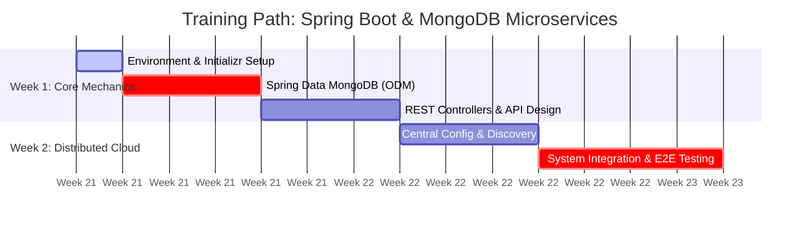

# README: Onboarding & Technical Training Guide (Updated)
## Topic: Microservices Architecture with Spring Boot and MongoDB

Welcome to your technical onboarding training! This repository serves as your direct instruction map for mastering the design, development, and deployment of scalable enterprise microservices using **Spring Boot**, **Spring Cloud**, and **MongoDB**. 

Please read through this document thoroughly to prepare your machine before day one and understand the evaluation parameters.

---

## 🛠️ Required Environment & Software Installation

To maximize your time during the hands-on labs, you must have your local environment fully configured prior to starting the curriculum. **Do not use outdated Java 8 or Java 11 versions.**

### 1. Java Development Kit (JDK)
* **Required Version:** **JDK 17** or **JDK 21** (Long Term Support versions).
* **Installation:** Install using [tutorial](https://www.geeksforgeeks.org/java/download-and-install-jdk-on-windows-mac-and-linux/) 
* **Verification:** Run `java -version` in your terminal. Ensure the output points to version 17 or higher.

### 2. Build Tool
* **Required Tool:** **Apache Maven (Version 3.6.3 or higher)**.
* **Alternative:** You may use the built-in Maven Wrapper (`./mvnw`) provided in your bootstrapped projects, but a local installation is highly recommended.

### 3. Integrated Development Environment (IDE)
Choose one of the following preferred enterprise IDEs:
* **IntelliJ IDEA** (Community or Ultimate Edition with Spring plugins enabled).
* **Spring Tool Suite (STS)** or **VS Code** with the *Spring Boot Extension Pack* installed.

### 4. Database & Runtime Containers
We do not use shared cloud databases for our training sandbox environments. You will run your infrastructure locally:
* **Docker Desktop:** Ensure Docker is running on your machine.
* **Database Image:** Pull the official MongoDB image using your terminal:
  ```bash
  docker pull mongo:latest
  ```
* **Local Run Command:** Spin up your test instance with the following command:
  ```bash
  docker run -d --name local-mongo -p 27017:27017 mongo:latest
  ```

### 5. API Testing Tools
* Download and install **Postman** or **Insomnia** to build and execute your microservice integration test suites.

---

## 📅 The 2-Week Guided Curriculum

You will follow the structural learning path mapped directly from the official **Spring.io** ecosystem documentation and our production deployment blueprints.



### Mandatory Training Labs Checklist
Trainees are required to successfully complete all **4 hands-on modules** in sequence:

1. 🏁 **Lab 1: The Database Layer** Complete [Accessing Data with MongoDB](https://spring.io/guides/gs/accessing-data-mongodb/) to understand document mappings, document IDs, and standard CRUD repositories.
2. 🏁 **Lab 2: The API Layer** Complete [Building a RESTful Web Service](https://spring.io/guides/gs/restservice/) to construct your API entry points and expose your MongoDB repositories via HTTP endpoints.
3. 🏁 **Lab 3: Orchestration and Infrastructure** Complete [Centralized Configuration](https://spring.io/guides/gs/centralized-configuration/) & [Service Registration and Discovery](https://spring.io/guides/gs/service-registration-and-discovery/) to set up a central property server and configure a Netflix Eureka registry server.
4. 🏁 **Lab 4: End-to-End System Integration** Complete the comprehensive production blueprint tutorial: [MongoDB Tutorial: Build a Microservices App With MongoDB](https://www.mongodb.com/docs/drivers/java/sync/current/integrations/spring-microservice/). This pulls every individual component together into a dynamic, multi-service application network.

---

## 🎯 Expectations and Criteria for completion

At the conclusion of this 2-week training cycle, you will present a working proof-of-concept (POC) application to your tech lead. You are expected to demonstrate complete competency in the following areas:

### 1. Database-per-Service Architecture
* **Strict Rule:** No two microservices can read or write to the same MongoDB collection or database. 
* You must demonstrate how your services pass data via REST protocols or inter-service communications using **OpenFeign** or **WebClient**, rather than direct data coupling.

### 2. Proficient Schema Modeling (NoSQL)
* You must explain your document indexing choices (`@Indexed`).
* You must demonstrate proper architectural reasoning regarding when you chose to **Embed** documents versus when you chose to **Reference** documents (`@DocumentReference`) based on read/write complexity.

### 3. Service Independence & High Availability
* Your services must not hardcode network ports or IP strings. They must resolve destinations using your **Eureka Service Registry**.
* Your unified frontend requests must route cleanly through your **Spring Cloud API Gateway** layer on a single public port.

### 4. Operational Monitoring
* Every microservice built must incorporate the `spring-boot-starter-actuator` dependency. 
* You will be asked to demonstrate how to monitor application health states using the `/actuator/health` check endpoints.

---

## 🆘 Getting Help During Training

* **Check the Reference Implementations:** Review the structural code blocks outlined inside the `reference-scaffolding/` directory of this repo.
* **Official Docs First:** Always check the [Official Spring Projects Docs](https://spring.io/projects) before stack-overflowing an error. Spring Boot 3+ has structural differences from older legacy frameworks.
* **Internal Slack Channel:** Post your exceptions, stack traces, and configuration files directly to `#eng-spring-boot-bootcamp`. 

**Good luck, and happy coding!**