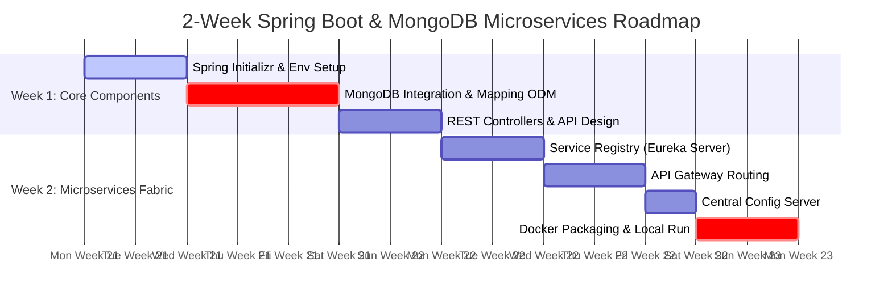
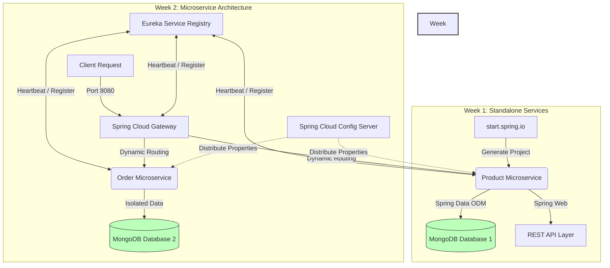

# Spring Boot Microservice & MongoDB Integration Guide

This document aggregates the architectural overview and hands-on guide selections into a structured, unified Markdown document. It can be directly integrated into your technical wiki, repository documentation, or internal onboarding guides.

# Two-Week Learning Roadmap Diagram

Below is the structured visual roadmap utilizing Mermaid syntax to track your progress over a 2-week learning cycle. It spans database modeling up to building a multi-service containerized architecture.



---


### Milestone Checklist

1. **End of Week 1:** You can run a standalone Spring Boot application that reads and writes custom Java objects inside distinct MongoDB collections via a JSON REST API.
2. **End of Week 2:** You spin up a cluster of distinct service networks, unified behind an API Gateway, pulling their configurations from a centralized server, completely self-contained.

---

## Architectural Overview

Building a microservices architecture using Spring Boot and MongoDB relies on three core projects from the Spring ecosystem: **Spring Boot**, **Spring Data MongoDB**, and **Spring Cloud**.

## Detailed Architectural Learning Workflow

This flowchart showcases how the pieces you study connect into your final development ecosystem:



### 1. Spring Boot Core Concepts
Spring Boot streamlines rapid enterprise development through automated configurations:
* **Spring Initializr ([start.spring.io](https://start.spring.io/)):** The web tool used to bootstrap your project infrastructure, choose build tools (Maven/Gradle), select Java runtimes, and add dependencies.
* **Auto-Configuration:** Dynamically scans the classpath to automatically configure application components (e.g., initializing connection pools when MongoDB starters are detected).
* **Unified Starters:** Bundled dependencies (like `spring-boot-starter-web` and `spring-boot-starter-data-mongodb`) that simplify dependency management.
* **Spring Projects Reference:** For a complete birds-eye view of all available technology modules, consult the [Spring Projects Page](https://spring.io/projects).

### 2. Spring Data MongoDB
Spring Data abstracts low-level driver mechanics into high-level patterns. For exhaustive documentation, reference the [Spring Data MongoDB Project Page](https://spring.io/projects/spring-data-mongodb).
* **The Repository Pattern:** Interfaces extending `MongoRepository<T, ID>` that dynamically generate standard CRUD implementations at runtime.
* **Derived Query Methods:** Declarative method signatures (e.g., `List<User> findByEmail(String email);`) that Spring automatically parses into MongoDB queries.
* **`MongoTemplate`:** A fluent API helper class utilized for highly complex query structures, aggregation pipelines, or bulk operations where standard repositories fall short.
* **Mapping Annotations:** Object-Document Mapping (ODM) annotations used to map Plain Old Java Objects (POJOs) to BSON collections:
  * `@Document(collection = "name")`: Maps the entity to a MongoDB collection.
  * `@Id`: Identifies the BSON `_id` primary key.
  * `@Indexed`: Instructs MongoDB to index the designated property.

### 3. Microservice Infrastructure (Spring Cloud)
Decoupled services leverage Spring Cloud to handle network coordination. The comprehensive feature set can be reviewed via the [Spring Cloud Project Page](https://spring.io/projects/spring-cloud).
* **Service Discovery (Eureka / Consul):** A dynamic registry where microservices automatically broadcast their network coordinates (IP and port) so that instances can discover one another without hardcoding endpoints.
* **API Gateway (Spring Cloud Gateway):** A unified reverse proxy layer executing edge routines like routing, token verification, and rate-limiting. Detailed configurations are available on the [Spring Cloud Gateway Reference Page](https://spring.io/projects/spring-cloud-gateway).
* **Centralized Configuration (Spring Cloud Config):** Externalizes environment properties into a central server (typically backed by Git), pushing configurations dynamically across the network. More information can be found at the [Spring Cloud Config Reference Page](https://spring.io/projects/spring-cloud-config).
* **Inter-Service Communication:** Handled via declarative REST clients (**OpenFeign**) or non-blocking reactive pipelines (**WebClient**).

---

## Hands-On Learning Roadmap

To build proficiency sequentially, execute these selected guides from the official [Spring Guides Directory](https://spring.io/guides) in order.

### Step 1: Data Access Layer
* **Target Guide:** [Accessing Data with MongoDB](https://spring.io/guides/gs/accessing-data-mongodb/)
* **Core Skills:** Schema mapping, basic CRUD repositories, and integrating a local or containerized MongoDB connection string.

### Step 2: REST API Construction
* **Target Guide:** [Building a RESTful Web Service](https://spring.io/guides/gs/restservice/)
* **Core Skills:** Structuring `@RestController` classes, mapping HTTP verbs (`GET`, `POST`, `PUT`, `DELETE`), and automatic JSON payload serialization.
* **Integration Task:** Combine Step 1 and Step 2 by exposing your MongoDB queries via RESTful endpoints.

### Step 3: Service Discovery and Cloud Architecture
* **Target Guides:** [Centralized Configuration](https://spring.io/guides/gs/centralized-configuration/) & [Service Registration and Discovery](https://spring.io/guides/gs/service-registration-and-discovery/)
* **Core Skills:** Initializing a central config server, standing up a Netflix Eureka registry server, and registering individual microservices to communicate over a local network fabric.

### Step 4: System Integration (Production Blueprint)
* **Target Guide:** [MongoDB Tutorial: Build a Microservices App With MongoDB](https://www.mongodb.com/docs/drivers/java/sync/current/integrations/spring-microservice/)
* **Core Skills:** Merging individual Spring Cloud components, implementing database-per-service isolation, and testing cross-service API routing.

---

## Reference Implementations

Below are the base scaffolding code blocks required to test your single-service MongoDB integration.

### 1. Build File Configuration (`pom.xml` snippet)
```xml
<dependencies>
    <dependency>
        <groupId>org.springframework.boot</groupId>
        <artifactId>spring-boot-starter-web</artifactId>
    </dependency>
    
    <dependency>
        <groupId>org.springframework.boot</groupId>
        <artifactId>spring-boot-starter-data-mongodb</artifactId>
    </dependency>
</dependencies>
```

### 2. Document Entity (`Product.java`)
```java
package com.example.catalogservice.model;

import org.springframework.data.annotation.Id;
import org.springframework.data.mongodb.core.mapping.Document;
import org.springframework.data.mongodb.core.mapping.Indexed;

@Document(collection = "products")
public class Product {
    
    @Id
    private String id;
    
    @Indexed
    private String sku;
    private String name;
    private Double price;

    // Constructors
    public Product() {}

    public Product(String sku, String name, Double price) {
        this.sku = sku;
        this.name = name;
        this.price = price;
    }

    // Getters and Setters
    public String getId() { return id; }
    public void setId(String id) { this.id = id; }
    public String getSku() { return sku; }
    public void setSku(String sku) { this.sku = sku; }
    public String getName() { return name; }
    public void setName(String name) { this.name = name; }
    public Double getPrice() { return price; }
    public void setPrice(Double price) { this.price = price; }
}
```

### 3. Data Repository Interface (`ProductRepository.java`)
```java
package com.example.catalogservice.repository;

import com.example.catalogservice.model.Product;
import org.springframework.data.mongodb.repository.MongoRepository;
import org.springframework.stereotype.Repository;

import java.util.Optional;

@Repository
public interface ProductRepository extends MongoRepository<Product, String> {
    Optional<Product> findBySku(String sku);
}
```

### 4. REST Controller Layer (`ProductController.java`)
```java
package com.example.catalogservice.controller;

import com.example.catalogservice.model.Product;
import com.example.catalogservice.repository.ProductRepository;
import org.springframework.http.HttpStatus;
import org.springframework.http.ResponseEntity;
import org.springframework.web.bind.annotation.*;

import java.util.List;

@RestController
@RequestMapping("/api/products")
public class ProductController {

    private final ProductRepository productRepository;

    public ProductController(ProductRepository productRepository) {
        this.productRepository = productRepository;
    }

    @GetMapping
    public List<Product> getAllProducts() {
        return productRepository.findAll();
    }

    @PostMapping
    public ResponseEntity<Product> createProduct(@RequestBody Product product) {
        Product savedProduct = productRepository.save(product);
        return new ResponseEntity<>(savedProduct, HttpStatus.CREATED);
    }

    @GetMapping("/sku/{sku}")
    public ResponseEntity<Product> getProductBySku(@PathVariable String sku) {
        return productRepository.findBySku(sku)
                .map(product -> new ResponseEntity<>(product, HttpStatus.OK))
                .orElse(new ResponseEntity<>(HttpStatus.NOT_FOUND));
    }
}
```

### 5. Properties Configuration (`application.yml`)
```yaml
spring:
  application:
    name: catalog-service
  data:
    mongodb:
      uri: mongodb://localhost:27017/catalog_db

server:
  port: 8081
```

# Two-Week Learning Roadmap Diagram

Below is the structured visual roadmap utilizing Mermaid syntax to track your progress over a 2-week learning cycle. It spans database modeling up to building a multi-service containerized architecture.


---


### Milestone Checklist

1. **End of Week 1:** You can run a standalone Spring Boot application that reads and writes custom Java objects inside distinct MongoDB collections via a JSON REST API.
2. **End of Week 2:** You spin up a cluster of distinct service networks, unified behind an API Gateway, pulling their configurations from a centralized server, completely self-contained.